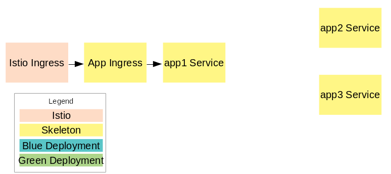
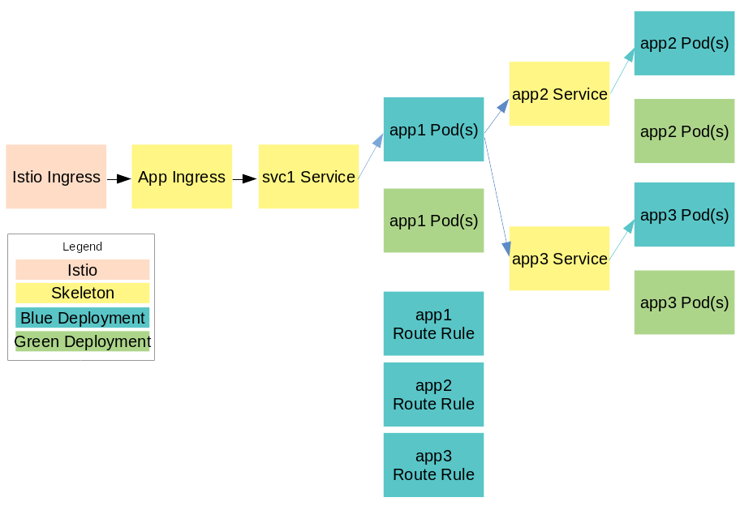
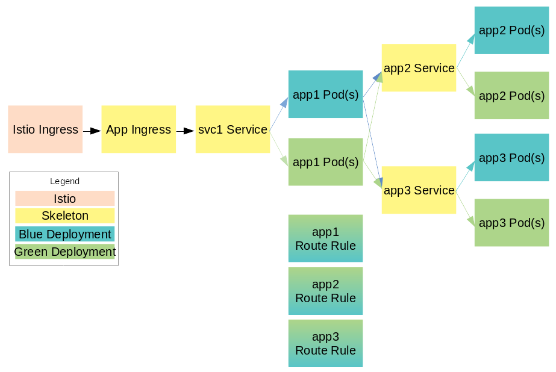

# Blue/Green Deployment with Helm and Istio

The constructs of the blue/green deployment using Istio and Helm can be summarized by the following:

- Three different Helm releases
    - Skeleton: includes the base components like services, ingress, and route rules
    - Blue: bits deployment (pods)
    - Green: bits deployment (pods)

## Stage 0: Skeleton

Description: Deploy the base components for routing traffic. These components do not change frequently, and are not part of either the blue or the green deployments.

```
$ # from the root of the repo
$ helm install --name skeleton --set skeleton=true helloworldtelephone/
```



## Stage 1: Blue deployment ("v1")

Description: Deploy the initial bits of the application

```
$ # from the root of the repo
$ helm install --name blue helloworldtelephone/
```


## Stage 2: Green deployment with no traffic

Description: Deploy the "v2" bits but keep all traffic going to the blue deployment

```
$ # from the root of the repo
$ helm install --name green helloworldtelephone/
```



## Stage 3: Shift partial traffic to the green deployment

Description: Move some traffic (.e.g 5%, 20%, etc.) to the green deployment. This is considered "v2" of the application bits

```
$ # from the root of the repo
$ helm upgrade --set skeleton=true --set blue.weight=50 --set green.weight=50 skeleton helloworldtelephone/
```



## Stage 4: Shift all traffic to the green deployment

Description: When the new deployment has proven it can and should handle 100% of the traffic, shift all traffic to it

```
$ # from the root of the repo
$ helm upgrade --set skeleton=true --set blue.weight=0 --set green.weight=100 skeleton helloworldtelephone/
```


## Stage 5: Remove the old deployment

Description: After all traffic is successfully routed to the new/green/v2 deployment and there is confidence that is a successful deployment, you can optionally remove the old/blue/v1 deployment. You can also keep it in place for two different reasons:

```
$ helm delete blue
```

1. Capability to fall back to the old build by changing route rules weights
1. Placeholder for the vNext build/release


